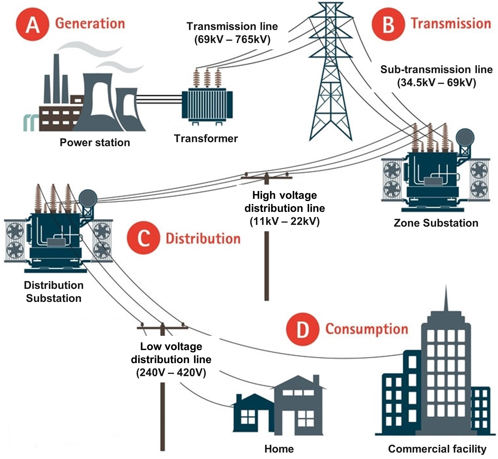

# QUT Zone Substation Security - MMS datasets

## Background
Zone Substations are used to transform sub-transmission voltages (typically 34.5 kV to 69 kV) to high-voltage distribution voltages (typically 11 kV to 22 kV) and to act as controlling points between different high-voltage networks. Figure 1 illustrates the overall architecture and process of common power girds.

*Figure 1. Architecture and process of common power girds.*

Retrieved and edited from https://www.copper.org/environment/sustainable-energy/grid-infrastructure/

## Dataset Description
The dataset was generated and collected from a software-based simulation testbed. The details of the simulation testbed are shown in [QUT-ZSS-2023-Simulation](https://github.com/CSCRC-SCREED/QUT-ZSS-2023-Simulation).

The dataset contains several network behaviours in the station bus level of an IEC-61850-compliant zone substation. The dataset is compatible with actual substation network traffic, including benign IEC-61850 MMS messages.